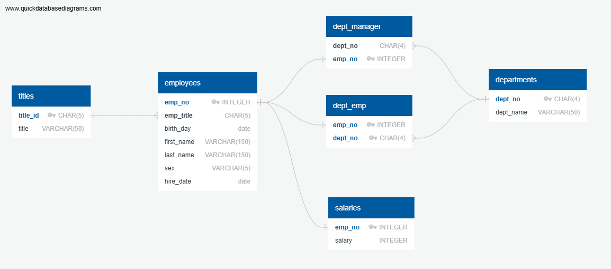
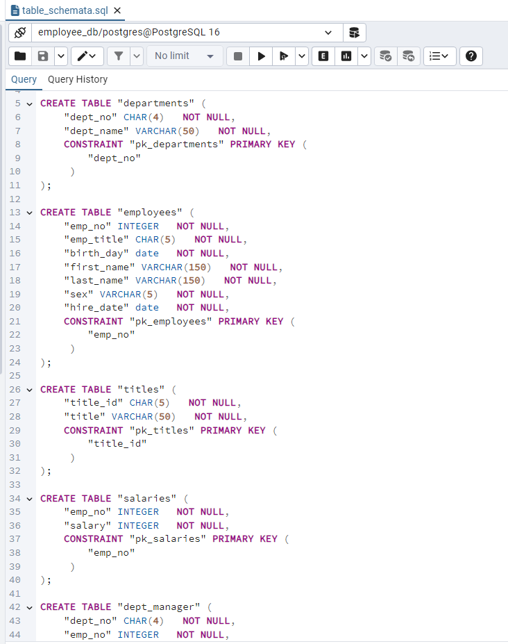
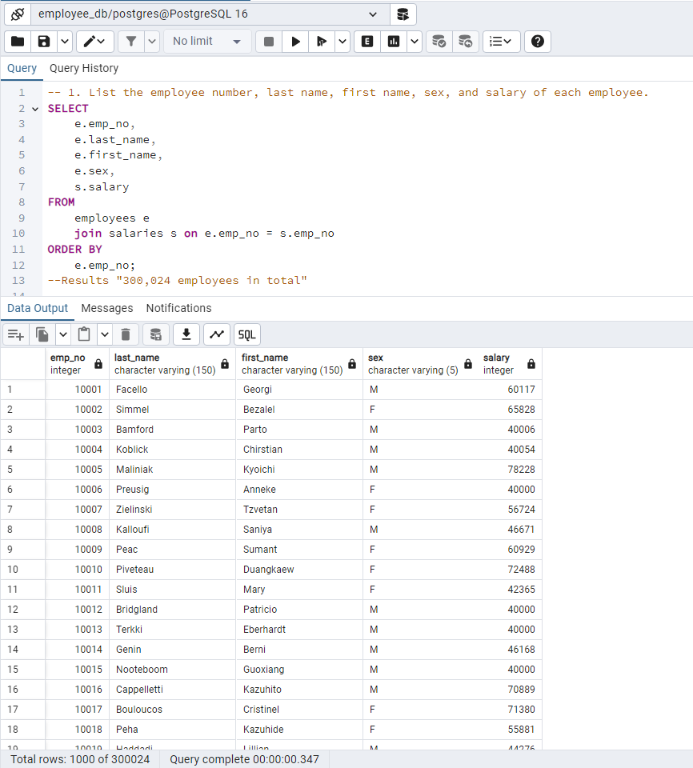

# ds_module_9_SQL
Homework Module 9 - SQL
======== 
Objective
----
This project was done with the intention of designing tables to contain data from CSV files that were imported into a SQL database, to perform data modeling, data engineering and data analysis, based on the following description:

It’s been two weeks since you were hired as a new data engineer at Pewlett Hackard (a fictional company). Your first major task is to do a research project about people whom the company employed during the 1980s and 1990s.
Six CSV files were provided that contain the information necessary to carry out the research project.

Data Modeling
--
* With the CSV files sketch an Entity Relationship Diagram of the tables using the tool https://www.quickdatabasediagrams.com/.

Data Engineering
--
Using the information provided, a table schema was created for each of the six CSV files to import the data into the tables.
[text](data_engineering/table_schemata.sql)

Data Analysis
--
Answer the next questions using the SQL database:

1. List the employee number, last name, first name, sex, and salary of each employee.
2. List the first name, last name, and hire date for the employees who were hired in 1986.
3. List the manager of each department along with their department number, department name, employee number, last name, and first name.
4. List the department number for each employee along with that employee’s employee number, last name, first name, and department name.
5. List first name, last name, and sex of each employee whose first name is Hercules and whose last name begins with the letter B.
6. List each employee in the Sales department, including their employee number, last name, and first name.
7. List each employee in the Sales and Development departments, including their employee number, last name, first name, and department name.
8. List the frequency counts, in descending order, of all the employee last names (that is, how many employees share each last name).

